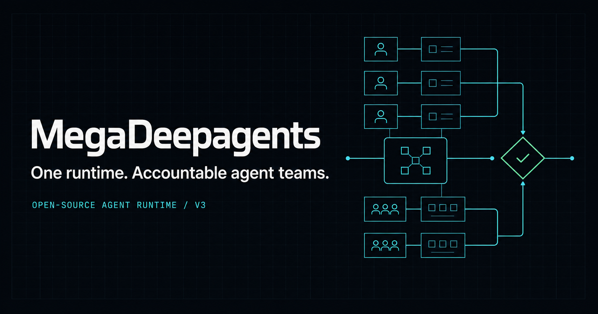

# MegaDeepagents V3

[简体中文](README.md) | [English](README.en.md)

[Project website](https://megadeepagents.vercel.app) ·
[Architecture](docs/architecture.md) ·
[API](docs/api.md) ·
[Deployment](docs/deployment.md)

MegaDeepagents is a local-first, recoverable, observable, and governed multi-agent task runtime. Browser, API, and CLI requests enter one LangGraph Root Graph. DeepAgents powers the worker agent loop, while the control plane and fail-closed Verifier decide whether a task has actually succeeded.

> If this project helps your multi-agent engineering work, a Star is appreciated. Issues, run feedback, and improvement ideas are welcome.



## Why MegaDeepagents

Many multi-agent demos coordinate conversations but leave ownership, durable state, verification, and recovery implicit. MegaDeepagents makes those concerns first-class:

- one runtime shared by browser, API, and CLI clients
- versioned plans separated from transactional execution state
- durable task ownership, bounded retries, and restart recovery
- artifact-first completion with fail-closed verification
- replayable lifecycle, tool, heartbeat, validation, retry, and failure events
- optional human approval and operator recovery paths
- isolated Git worktrees for coding agents with governed integration
- optional LangSmith integration; the runtime remains usable without it

## V3 execution path

```text
Vue 3 / API / CLI
        ↓
RunApplicationService
        ↓
LangGraph Root Graph
   ├── single path
   └── team supervisor path
        ↓
TaskGraph → TransactionalTaskService → TaskBoard
        ↓
ParallelTeamScheduler → DeepAgentExecutor
        ↓
ArtifactStore → Verifier → Repair / Replan / HITL / Finalize
        ↓
SQLite + replayable Event Envelope
```

The key runtime rules are deliberately strict:

- `TaskGraph` is the versioned plan; `TaskBoard` is the source of truth for execution state, ownership, and attempts.
- Workers may submit `PRODUCED` artifacts and evidence, but they cannot mark their own tasks `SUCCEEDED`.
- Verification fails closed. Missing models, tests, formats, or artifacts never become fabricated success.
- SQLite uses a shared connection policy, WAL, busy timeouts, and transactions so runs can recover after process restarts.
- Failures are classified—rate limit, timeout, network, permission, contract, and more—and retried with bounded exponential backoff.
- Run diagnostics identify healthy, pending, stuck, failed, and completed states explicitly.
- Coding tasks can bind a Git repository, isolate each agent in a worktree, and merge through a governed queue.

## Quick start

Requirements: Python 3.11+ and Node.js 20+.

```bash
cp .env.example .env
python -m venv .venv
python -m pip install -e ".[dev]"
npm --prefix frontend ci
```

Start the backend:

```bash
python -m uvicorn app.main:app --host 127.0.0.1 --port 8081 --reload
```

Start the frontend in another terminal:

```bash
npm --prefix frontend run dev
```

Open `http://127.0.0.1:5173`.

For a production build served from the same FastAPI origin:

```bash
npm --prefix frontend run build
python -m uvicorn app.main:app --host 127.0.0.1 --port 8081
```

## Docker

```bash
cp .env.example .env
docker compose up --build
```

Persistent data is stored in the `megadeepagents-data` volume. To let agents operate on host repositories, set `HOST_REPOSITORY_ROOT` and mount the allowed parent directory at `/repositories`.

## API

New clients should use `/api/v1` only.

| Capability | Endpoint |
|---|---|
| Runs | `POST/GET /api/v1/runs` |
| Control | `POST /api/v1/runs/{id}/pause|resume|retry|cancel` |
| Diagnostics | `GET /api/v1/runs/{id}/diagnostics` |
| Live events | `GET /api/v1/runs/{id}/stream?after_sequence=N` |
| Tasks / graph | `GET /api/v1/runs/{id}/tasks`, `task-graph` |
| Agents / messages | `GET /api/v1/runs/{id}/agents`, `POST .../messages` |
| Artifacts | `GET /api/v1/runs/{id}/artifacts`, `.../content`, `.../download` |
| Workspace files | `GET /api/v1/runs/{id}/files/content?path=...` (Run-scoped) |
| Approvals | `GET/POST .../permissions`, `.../plans` |
| Verification / errors / Git | `GET .../verification`, `errors`, `git`, `worktrees` |

See [the complete API contract](docs/api.md). Interactive OpenAPI documentation is available at `/docs` while the server is running.

## Validation

```bash
python -m compileall -q app
pytest -m "not live_model and not real_langsmith"
npm --prefix frontend test
npm --prefix frontend run build
```

Live-model and LangSmith tests are skipped by default and must be enabled explicitly with credentials. Model unavailability is never treated as a passing result.

## Deployment boundary

The Vercel deployment publishes the bilingual project website from `website/`. It does not host the runtime console, Python workers, LangGraph, SQLite, or local worktrees.

The self-hosted Docker deployment serves the persistent backend and the `frontend/` runtime console. These are separate deployment surfaces.

## Documentation

- [Architecture](docs/architecture.md)
- [Codebase map](docs/codebase-map.md)
- [Development](docs/development.md)
- [Deployment](docs/deployment.md)
- [Database](docs/database.md)
- [Observability and recovery](docs/observability.md)
- [V3 migration](docs/migration-v3.md)
- [V3 refactor audit](docs/refactor-v3/00-current-runtime-audit.md)
